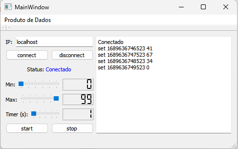
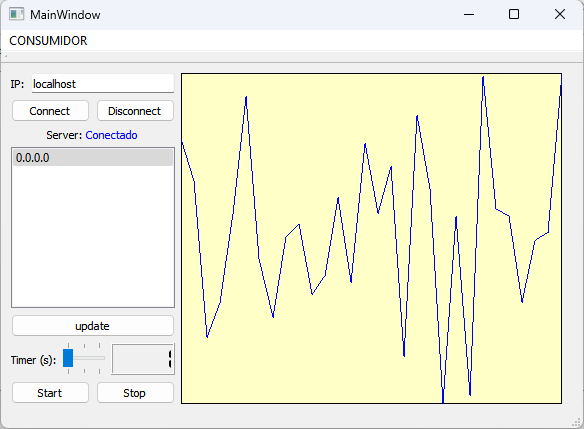

# Projeto de Aquisição e Supervisão de Dados usando Qt

## Introdução

Este projeto consiste no desenvolvimento de três programas de computador que simulam um sistema de aquisição e supervisão de dados em uma rede local. Os módulos incluem um **servidor** e dois clientes: um **cliente produtor** de dados e um **cliente supervisor** de dados. O servidor aguarda conexões TCP na porta 1234 e responde aos comandos dos clientes. O cliente produtor envia dados para o servidor, enquanto o cliente supervisor recupera informações do servidor. O objetivo é proporcionar a prática da programação orientada a objetos usando a biblioteca Qt.

## Módulo Servidor

O módulo servidor implementa um servidor TCP capaz de aguardar conexões na porta TCP/1234. Ele utiliza o protocolo TCP para estabelecer conexões com clientes. Quando um cliente se conecta à porta do servidor, é criado um socket de comunicação exclusivo para essa conexão. O servidor interpreta mensagens em texto simples enviadas pelos clientes.

Existem três comandos suportados pelo protocolo de aplicação do servidor:

- Comando **list**: Retorna a lista de máquinas que possuem dados armazenados no servidor. Exemplo de uso:
```
$ telnet 127.0.0.1 1234
list
127.0.0.1
```

- Comando **get**: Requer o número IP do cliente produtor de dados e o número de amostras desejadas. Exemplo de uso:
```
$ telnet 127.0.0.1 1234
get 127.0.0.1 1
1496658174409 34
```

- Comando **set**: Requer uma combinação de DATA e HORA, juntamente com o dado a ser armazenado no servidor. Exemplo de uso:
```
$ telnet 127.0.0.1 1234
set 127.0.0.1
set 1496658174409 34
```

Todos os comandos devem ser enviados como literais. O indicador de data/hora é um número longo que representa a quantidade de milissegundos desde 1/1/1970. Quando o servidor recebe essas sequências de literais, ele as separa com base nos espaços e armazena os dados associados em uma estrutura interna.

Durante a execução do servidor, é exibida uma mensagem com o IP local do servidor na saída do aplicativo.

Esses são exemplos de uso do servidor através do comando `telnet`.
## Módulo Cliente Produtor de Dados

O cliente produtor de dados deve ser capaz de se conectar a um servidor em execução e enviar comandos **set** para ele. Esse módulo simula um processo de coleta e envio de dados para o servidor em intervalos regulares.

O cliente deve ser capaz de enviar dados (possivelmente aleatórios) para o servidor em intervalos regulares. O usuário do módulo produtor deve ser capaz de realizar as seguintes operações:

- Indicar o endereço **IP do servidor** ao qual deseja se conectar.
- Indicar a **faixa de valores (mínimo-máximo)** que podem ser enviados ao servidor, os valores vão de 0 a 99.
- Indicar o **intervalo de tempo (em segundos)** entre o envio de dois conjuntos de dados consecutivos, o tempo vai de 1 a 20.
- Conectar e Desconectar do servidor ao pressionar um botão (**Connect** e **Disconnect**).
- Iniciar e parar um cronometro para enviar os dados gerados.
- Inicia e parar a transmissão dos dados gerados para o servidor (em timer: **start** e **stop**).

A interface do módulo produtor de dados pode ser semelhante à mostrada na imagem abaixo:



## Módulo Cliente supervisor de Dados

O cliente supervisor de dados desempenha um papel mais complexo em comparação ao cliente produtor. Ele se conecta a um servidor específico, recupera os endereços das máquinas que produziram dados e gera um gráfico de data/hora em relação aos valores da sequência de dados fornecida pelo servidor.

O módulo do cliente supervisor oferece as seguintes funcionalidades ao usuário:

- Possibilidade de indicar o endereço **IP do servidor** de dados desejado.
- Iniciar e parar a conexão com o servidor pressionando um botão (**Connect** e **Disconnect**).
- Após a conexão, **exibir uma lista das máquinas** que produziram dados, possivelmente usando um widget de lista (listwidget). Mas para isso, precisamos atualizar a lista pressionando **update**.
- Permitir a **seleção de uma máquina na lista** para visualizar os dados correspondentes.
- Com uma máquina selecionada, disponibilizar dois botões para o usuário: um para iniciar o recebimento de dados e outro para parar. (em timer: **Start** e **Stop**).
- Permitir ao usuário modificar o **intervalo de tempo** entre a **captura** de do conjuntos de dados.

A cada recebimento de dados, o cliente supervisor deve plotar um gráfico de tempo (em x) e valor (em y). Cada vez que executamos a captura de dados atualizamos esse gráfico.


